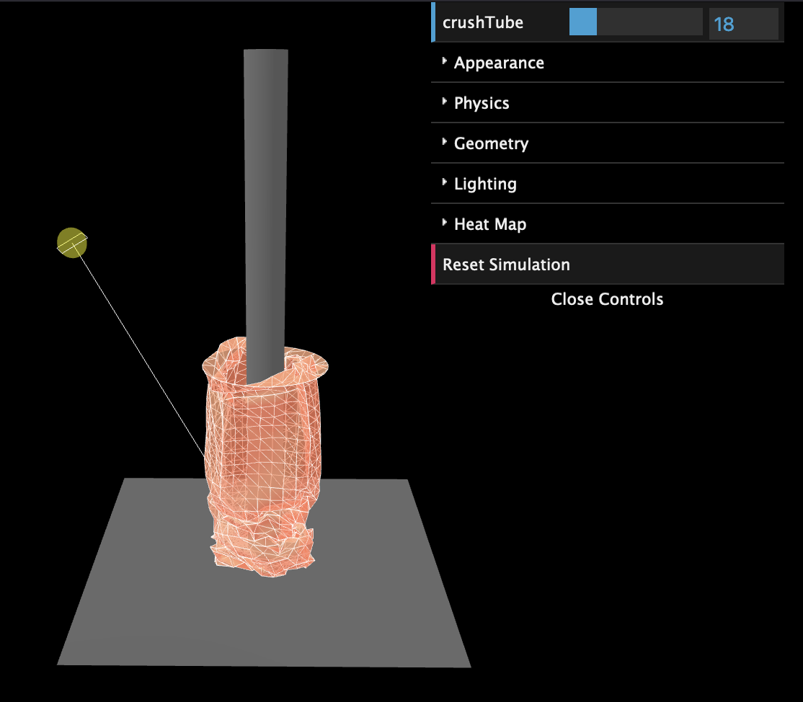

# WebGL cloth simulation 
This project is a 3D tool that helps arists study fabric behavior, focusing on what is know to artists as 'spiral folds'. You can see this type of fold in everyday life when you roll up your sleeves. It's what happens when fabric wraps around something rigid (like your arm) and gets compressed, creating a spiral pattern in the material.



## Technical Details
The simulation was written using the WebGL API and uses the [Three.js](https://threejs.org/) and [Cannon.js](https://github.com/schteppe/cannon.js) to handle 3D and physics, respectively. The project itself was built with [Vite](https://vite.dev/).

## Installation requirements
- MacOS or Linux
- Node.js
- npm

Node.js and npm can be easily installed using a package manager. If you are using Ubuntu for example, this can be accomplished by:
```
sudo apt install nodejs npm
```

## Installation instructions
1. Change directory
```
cd cloth-simulation
``` 
2. Once in the directory, run 
``` 
npm install
```
3. Finally, run
```
npm run preview
```
This should serve the files from `dist` at `http://localhost:4173`
## How to use
Once on the local server, you should see something like


The orange tube is the cloth that is yet to be crushed and the stuff on the upper right is the GUI, handled by [dat.gui](https://github.com/dataarts/dat.gui). The GUI has various parameters you can adjust of the simulation, allowing you to view the changes in real-time.

The scene can be rotated, zoomed, and panned thanks to OrbitControls which is part of Three.js. 

To crush the cloth tube, simply adjust the crushTube slider at the top. This adjusts the height of the top boundary of the cloth tube.


The appearance of the cloth can be adjusted. The wireframe can be toggled on and off, the color of the cloth can be changed, etc. 

